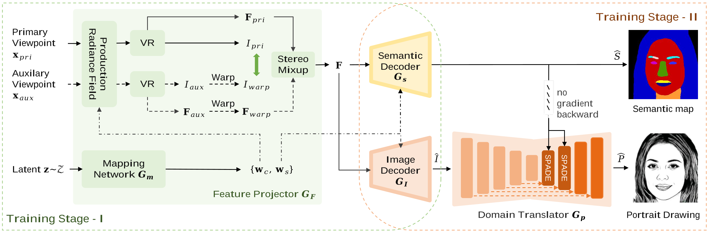
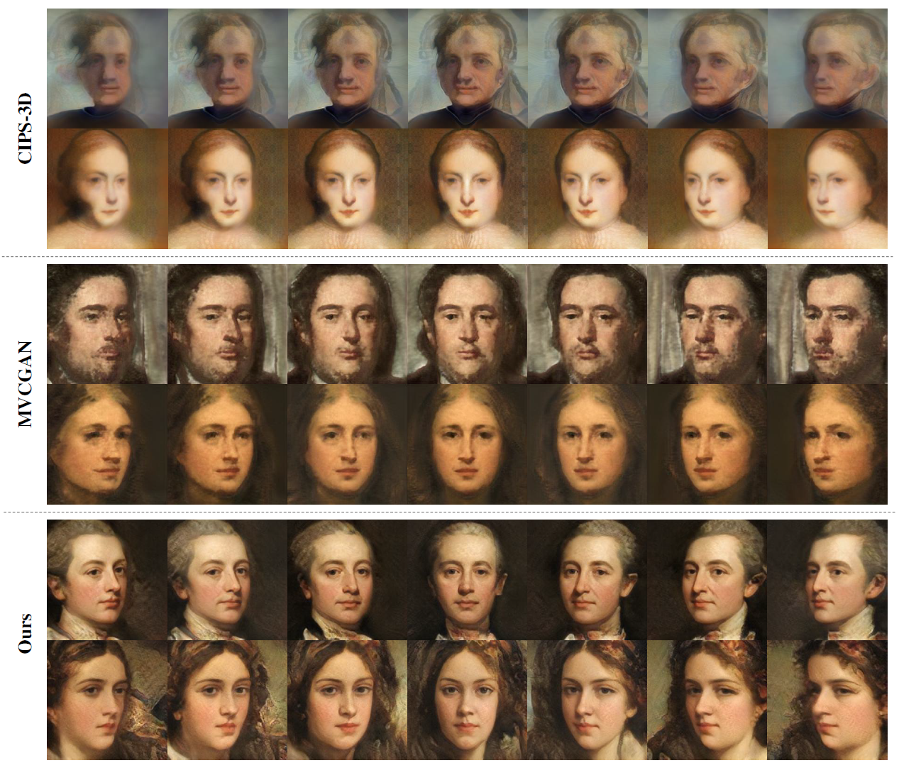

# SAGE: Semantic-aware Generation of Multi-view Portrait Drawings, IJCAI 2023 

## Abstract
Neural radiance fields (NeRF) based methods have shown amazing performance in synthesizing 3D-consistent photographic images, but fail to generate multi-view portrait drawings. The key is that the basic assumption of these methods -- *a surface point is consistent when rendered from different views* -- doesn't hold for drawings. In a portrait drawing, the appearance of a facial point may changes when viewed from different angles. Besides, portrait drawings usually present little 3D information and suffer from insufficient training data. To combat this challenge, in this paper, we propose a *Semantic-Aware GEnerator* (SAGE) for synthesizing multi-view portrait drawings. Our motivation is that facial semantic labels are view-consistent and correlate with drawing techniques. We therefore propose to collaboratively synthesize multi-view semantic maps and the corresponding portrait drawings. To facilitate training, we design a semantic-aware domain translator, which generates portrait drawings based on features of photographic faces. In addition, use data augmentation via synthesis to mitigate collapsed results.We apply SAGE to synthesize multi-view portrait drawings in diverse artistic styles. Experimental results show that SAGE achieves significantly superior or highly competitive performance, compared to existing 3D-aware image synthesis methods. Our page site is https://vmaibex.github.io/. 

## Paper Information

Biao Ma, Fei Gao, Chang Jiang, Nannan Wang, Gang Xu, "Semantic-aware Generation of Multi-view Portrait Drawings," the 32nd International Joint Conference on Artificial Intelligence (IJCAI), accepted, 2023.

## Pipeline



## Synthesized Sketches


## Synthesized Oil-paintings (WikiArt)



## Train our model
### Environment requirement
Please check file ```requirements.txt``` to make sure your python version and dependent packages are right. Our python version is 3.6.7. You can also install without following our dependencies and just make sure the code works, if you have questions, please send me an email.
```
git clone https://github.com/AiArt-HDU/SAGE.git
cd SAGE

conda create -n sage python=3.6.7
conda activate sage

pip3 install torch==1.8.2 torchvision==0.9.2 torchaudio==0.8.2 --extra-index-url https://download.pytorch.org/whl/lts/1.8/cu111

pip install -e pytorch_ema_lib
```

### Dataset and checkpoint
#### Pre-training stage
In the pre-training stage, we use CelebA-HQ dataset to train our model, click this link https://github.com/switchablenorms/CelebAMask-HQ and make sure you have initial portraits and corresponded semantic maps.
#### Finetune stage
We release sketch style dataset and Pen drawing dataset for training. We are unable to make the line art dataset public for some reasons. The download link is in next section.
#### checkpoint
We expose the checkpoint file for the pre-training phase as well as finetune phase. please click link [dataset and checkpoint](https://drive.google.com/drive/folders/1giltfkPI3oC5yWu_5jsLOwlpcJZjpgW0?usp=share_link) to download.


### Train
```
python train.py --curriculum CelebA --output_dir [your path]

eg: python train.py --curriculum CelebA --output_dir pre-train
```

### Finetune
In this section, you need to check file ```curriculum_finetune.py``` to make sure your data path is right. And you need to see line 208 of script ```./generators/refinegan.py``` to unpack the comment, using u-net in finetune stage.
```
python finetune.py --curriculum CelebA --output_dir [your path] --load_dir [your pretrained ckpt path] --set_step 50000

eg: python finetune.py --curriculum ClebeA --output_dir style1 --load_dir pre-train --set_step 50000
```

### Rendering images
```
python render_multiview_image.py --path [ckpt_path]/generator.pth --output_dir images
```

### Some questions
If you want to train with wikiart dataset, please make sure you are familiar to our model, and delete semantic map branch, only use portrait Decoder. And when you use our wikiart ckpt to render images, please change the script to make the code work. Feel free to give me feedback and send me an email if you have any problems with the code.